## Eclipse project setup

* Open Eclipse
* File/New Maven Project
* Create sample class - StringStuff.java
* Create new Junit test case - scr.test - new Junit test case
* Select JUnit 4, same package, select class under test
* Add JUnit 4 to project structure
* Observe project structure
* Run initial test
* Debug initial test
* observe call-stack - no main method

## Unit tests structure

* Typical test structure
* Test workflow annotations - @Before, @BeforeClass, @After, @AfterClass - renamed in JUnit 5
* Tests should be separated and independent
* Demonstration

## Test assertions

* basic assertions: true, equals, arrayEquals, expecting exceptions

## Practice project - basic tests and stubs

* Write 2 classes - User and Project class

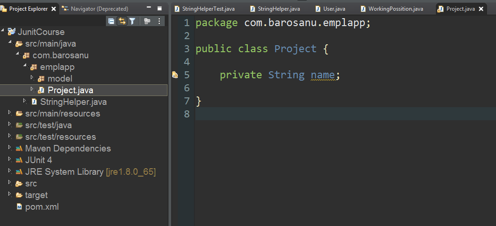

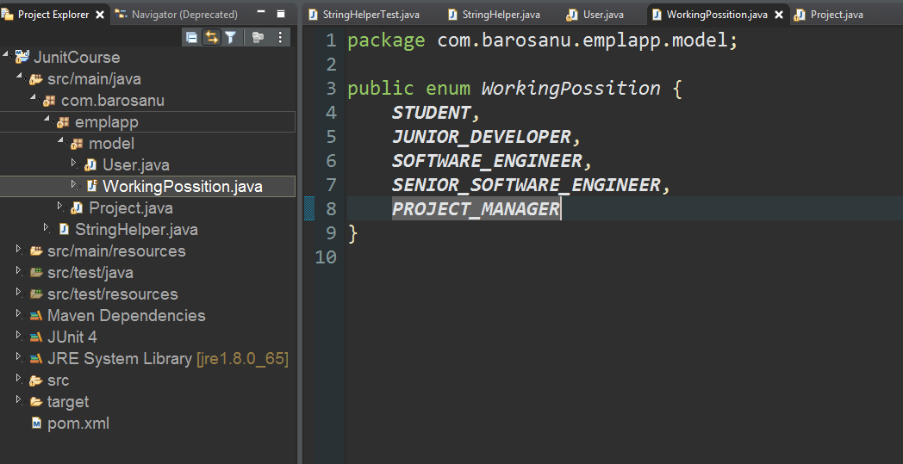

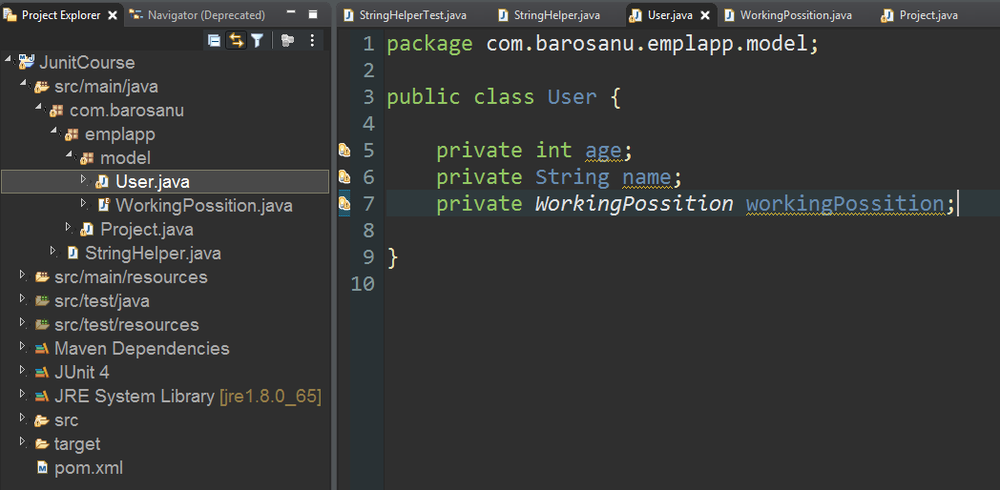

* Generate constructor and accessors using Eclipse.
* Test driven development: write test first
* Advanced assertion: AssertThat
* Hamcrest matchers

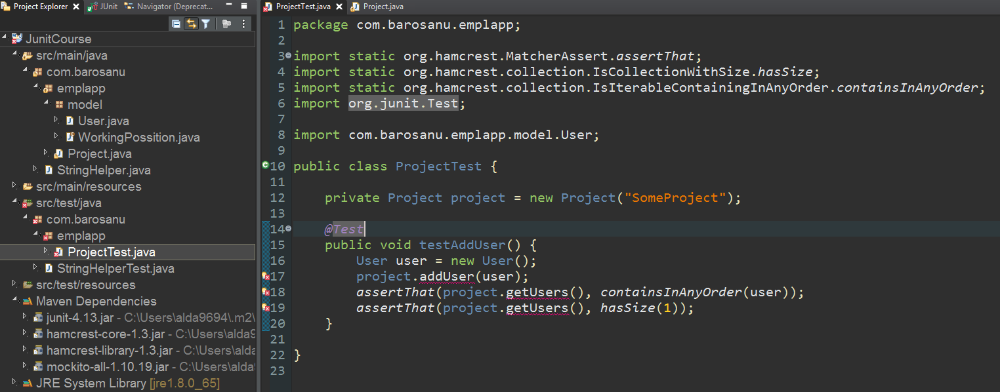

* Why is this test working?

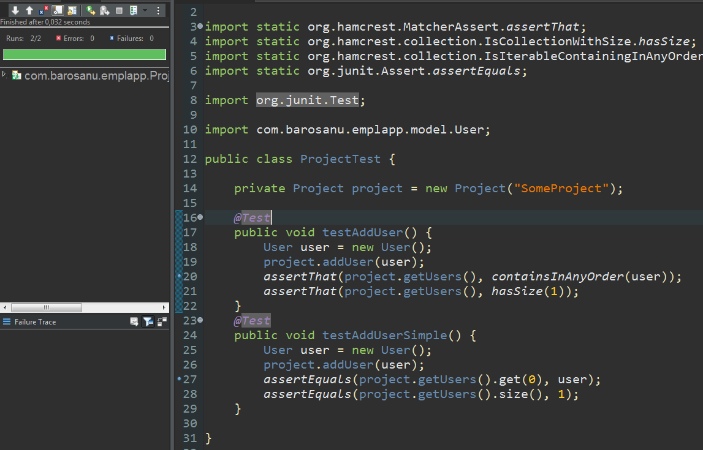

* correct test setUp:

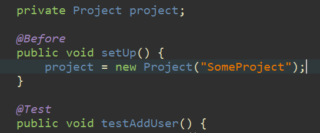

* What should be tested?

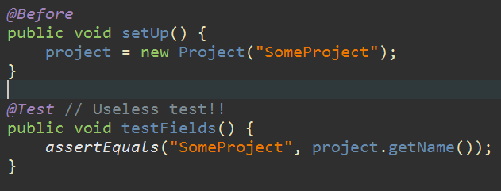

## Mocks

* Why do we need mocks?

* Project setUp:

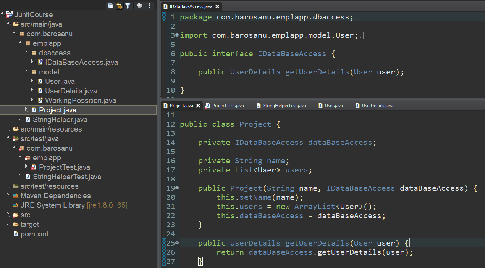

* Now out test has an error
* We can fix it like this:

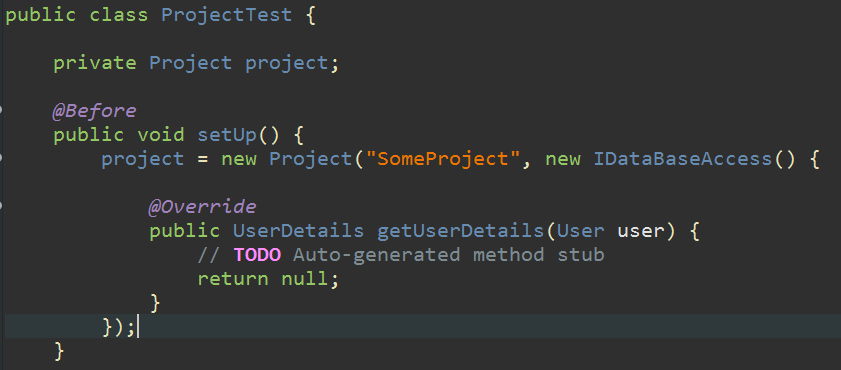

* But what if we extend the interface?

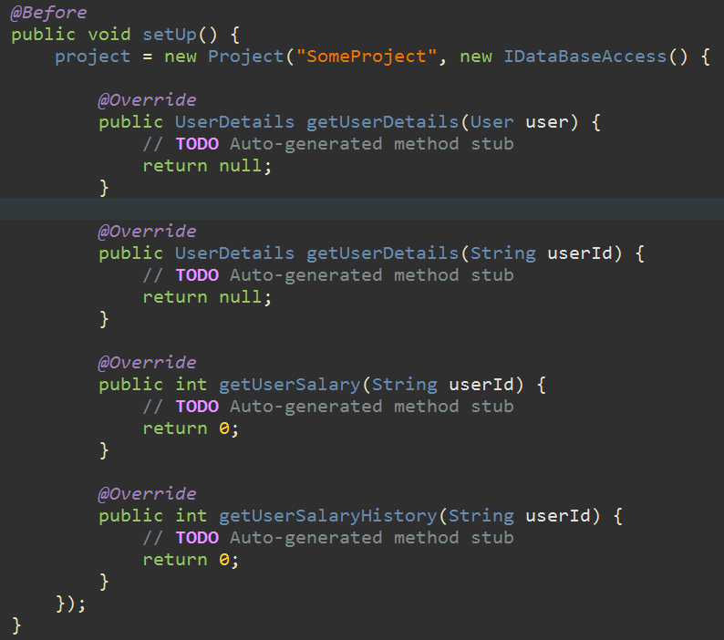

### Solution: MOCKS

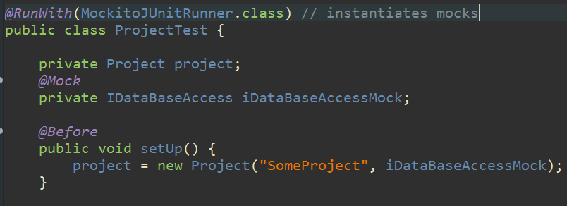

* Mock testing functionality: Verify

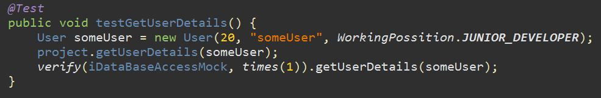

* Mock behavior: what is returned by the mock?

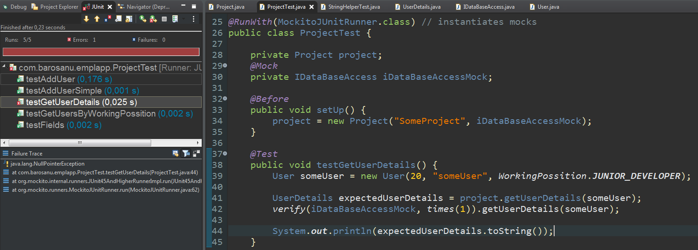

* Mock behavior: when -> then return

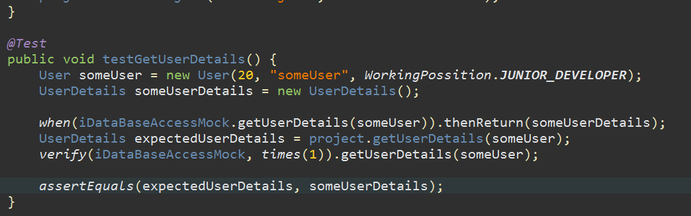

## Mocking project: HttpRequestBuilder

Write unit tests for this class:

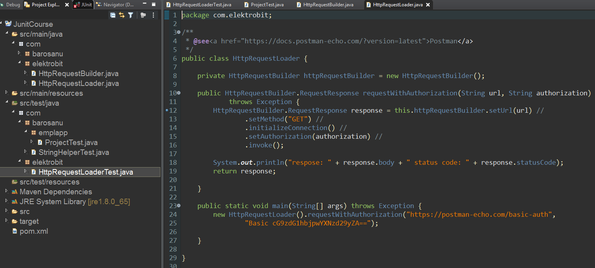

* Inject mocks
* use when -> thenReturn
* asserts
* verify

### Further reading:
https://www.vogella.com/tutorials/Mockito/article.html
https://www.amazon.com/Clean-Code-Handbook-Software-Craftsmanship/dp/0132350882
https://www.manning.com/books/test-driven